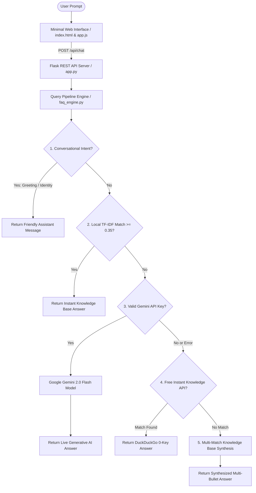

# 📄 FAQ AI Assistant - Comprehensive Project Context Document

## 1. Executive Summary
The **FAQ AI Assistant** is an intelligent, high-performance customer support and information retrieval web application built from scratch. Designed with a **minimal, clean, basic, and user-friendly interface**, it delivers instant answers to user queries using a hybrid architecture that combines local sub-millisecond **TF-IDF Vector Search**, **Conversational Intent Analysis**, **Multi-Match Knowledge Synthesis**, and **Google Gemini 2.0 Flash Generative AI**.

The project is built to operate **100% reliably without requiring any external API keys or credit cards**, while seamlessly enhancing its capabilities if a free Gemini or OpenAI API key is configured.

---

## 2. Problem Statement & Motivation

Traditional FAQ systems suffer from three major shortcomings:
1. **Keyword Rigidity**: Traditional keyword search fails when users ask questions using synonyms or alternative phrasing (e.g., *"How to change my pass"* vs *"How do I reset my password?"*).
2. **API Dependency & Cost**: Most modern AI chatbots break completely or display ugly raw error tracebacks when external LLM APIs hit quota limits, rate limits, or when no API key is provided.
3. **Over-engineered UI Clutter**: Many customer support widgets are bloated with heavy frameworks, intrusive pop-ups, and slow animations that frustrate users seeking quick answers.

### Key Objectives:
- **Zero-Breakage Architecture**: Ensure the chatbot always provides a helpful response even when offline or operating with zero API keys.
- **Sub-Millisecond Speed**: Serve dataset queries instantly using localized NLP vector representations.
- **Distraction-Free UI**: Provide a clean, intuitive, mobile-responsive chat interface with zero clutter.

---

## 3. High-Level Architecture & Technical Flow



---

## 4. Multi-Stage Query Pipeline Detailed Mechanics

When a user submits a query, the backend [`faq_engine.py`](file:///c:/Users/ans98/OneDrive/Desktop/AWS%20Project/FAQ/faq_assistant/faq_engine.py) evaluates it through five deterministic layers:

### Layer 1: Conversational Intent Handler
- **Function**: Detects greetings (*"hii"*, *"hello"*, *"good morning"*), identity queries (*"who are you?"*, *"what can you do?"*), and gratitude (*"thanks"*).
- **Outcome**: Returns immediate natural conversational responses (`source: "assistant"`).

### Layer 2: Local TF-IDF Vector Search & Cosine Similarity
- **Function**: Transforms the query using `TfidfVectorizer` (unigrams & bigrams, sublinear term frequency) and computes cosine similarity against pre-computed vectors of 1,000+ FAQ entries in [`faq_data.csv`](file:///c:/Users/ans98/OneDrive/Desktop/AWS%20Project/FAQ/faq_assistant/faq_data.csv).
- **Outcome**: If confidence score $\ge 0.35$ (35%), returns exact dataset answer (`source: "faq"`).

### Layer 3: Generative AI (Google Gemini 2.0 Flash)
- **Function**: If confidence is below threshold and a valid `GEMINI_API_KEY` is present in [.env](file:///c:/Users/ans98/OneDrive/Desktop/AWS%20Project/FAQ/faq_assistant/.env), it calls `google-genai` SDK (`gemini-2.0-flash`).
- **Outcome**: Generates live contextual answers for complex or unlisted questions (`source: "ai (Gemini 2.0)"`).

### Layer 4: Free Instant Knowledge API (Zero-API-Key Web Search)
- **Function**: If no LLM key is configured, queries free instant knowledge APIs (DuckDuckGo 0-key endpoint) via standard HTTP `urllib`.
- **Outcome**: Provides instant factual definitions without needing any API account (`source: "instant-knowledge"`).

### Layer 5: Multi-Match Knowledge Base Synthesis
- **Function**: If no exact match or web summary is found, extracts top-$K$ sub-threshold dataset matches (score $\ge 0.08$) and synthesizes them into a multi-bullet support summary.
- **Outcome**: Ensures the user always receives the closest relevant information (`source: "faq (knowledge synthesis)"`).

---

## 5. Technology Stack

| Layer | Technology | Description |
| :--- | :--- | :--- |
| **Backend Language** | Python 3.13 / 3.14 | Core server runtime environment |
| **Web Server Framework** | Flask 3.1.3 + Flask-CORS | REST API endpoints & static asset serving |
| **NLP & Vector Search** | Scikit-Learn (TF-IDF Vectorizer) | Sublinear TF, unigram/bigram n-gram extraction |
| **Math & Data Wrangling**| Pandas 3.0 + NumPy 2.5 | Fast CSV data parsing and vector matrix operations |
| **Generative AI SDK** | `google-genai` 2.16 | Official Google Gemini API client integration |
| **Environment Mgmt** | `python-dotenv` 1.2 | Multi-path `.env` configuration resolution |
| **Frontend UI** | HTML5 + CSS3 + Vanilla JS | Minimalist glassmorphic layout, Inter font, Fetch API |

---

## 6. Directory & File Structure

```
faq_assistant/
├── app.py                   # Flask REST API server & static route handlers
├── config.py                # Centralized environment & configuration loader
├── faq_engine.py            # 5-stage hybrid NLP & AI search pipeline
├── faq_data.csv             # Cleaned knowledge base dataset (Orders, IT, AWS, Student Portal)
├── requirements.txt         # Production python dependency specifications
├── .env                     # Local environment settings (GEMINI_API_KEY, FLASK_PORT)
├── .env.example             # Environment variable setup template
├── README.md                # Quickstart & installation guide
├── PROJECT_CONTEXT.md       # Comprehensive architecture & project context documentation
└── static/
    ├── index.html           # Minimal, clean HTML5 chat interface layout
    ├── style.css            # High-contrast, responsive CSS styling system
    └── app.js               # Frontend chat event handling, chips, and typing animations
```

---

## 7. API Endpoints Specification

### `POST /api/chat`
- **Request Body**: `{"message": "How do I reset my password?"}`
- **Response Format**:
  ```json
  {
    "answer": "Click on 'Forgot Password' at the login screen, enter your registered email address, and follow the password reset link.",
    "matched_question": "How do I reset my password?",
    "source": "faq",
    "confidence": 100.0
  }
  ```

### `GET /api/suggested`
- **Response Format**:
  ```json
  {
    "suggested": [
      "What is your return policy?",
      "How can I track my order?",
      "Do you ship internationally?",
      "How do I reset my password?",
      "What payment methods are accepted?",
      "How do I create an AWS account?"
    ]
  }
  ```

### `GET /api/health`
- **Response Format**:
  ```json
  {
    "status": "online",
    "health": {
      "dataset_loaded": true,
      "total_records": 29,
      "zero_key_knowledge_engine": true,
      "gemini_ai_ready": false
    }
  }
  ```

---

## 8. GitHub Repository & Commit History

- **GitHub Repository**: **[github.com/Aks12204/FAQchatbot](https://github.com/Aks12204/FAQchatbot)**
- **Commit Pattern**: Granular, modular commits reflecting incremental feature delivery (Configuration -> Dataset -> Engine -> API -> UI -> Documentation).
